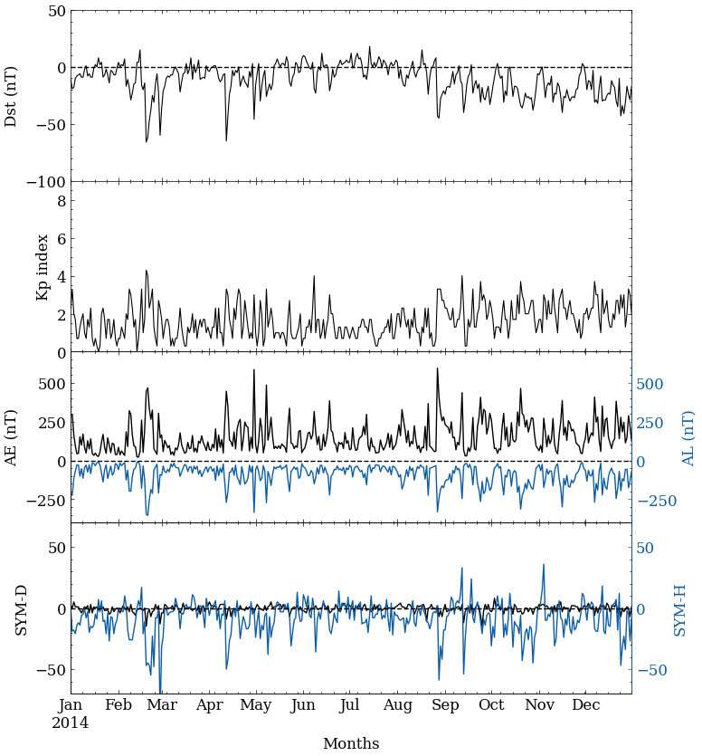

# Geomagnetic indices

## Dst index

Dst (Disturbance Storm Time) equivalent equatorial magnetic disturbance indices are derived from hourly scalings of low-latitude horizontal magnetic variation. Dst index is an index of magnetic activity derived from a network of near-equatorial geomagnetic observatories that measures the intensity of the globally symmetrical equatorial electrojet (the "ring current").

[Infos](https://www.ngdc.noaa.gov/stp/geomag/dst.html)
[Download data](https://wdc.kugi.kyoto-u.ac.jp/dstdir/)

## Kp Index

The K-index, and by extension the Planetary K-index, are used to characterize the magnitude of geomagnetic storms. Kp is an excellent indicator of disturbances in the Earth's magnetic field and is used by SWPC to decide whether geomagnetic alerts and warnings need to be issued for users who are affected by these disturbances.

The K-index quantifies disturbances in the horizontal component of earth's magnetic field with an integer in the range 0-9 with 1 being calm and 5 or more indicating a geomagnetic storm. The planetary 3-hour-range index Kp is the mean standardized K-index from 13 geomagnetic observatories between 44 degrees and 60 degrees northern or southern geomagnetic latitude. The label 'K' comes from the German word 'Kennziffer' meaning 'characteristic digit.' 

[Infos](https://www.swpc.noaa.gov/products/planetary-k-index)
[Download data](https://wdc.kugi.kyoto-u.ac.jp/dstdir/)

## ASY-D, ASY-H, SYM-D, SYM-H 

To describe the geomagnetic disturbances at mid-latitudes in terms of longitudinally asymmetric (ASY) and symmetric (SYM) disturbances for both H and D components 
respectively parallel and perpendicular to the dipole axis. SYM-H is essentially the same as the Dst index with a different time resolution.

[Infos](http://isgi.unistra.fr/indices_asy.php)

## Plotting

[See the code](https://github.com/LuizFillip/Geomagnetic-Solar-Indices/blob/main/plotIndices.py)

```
plotIndices(save = False)
```



